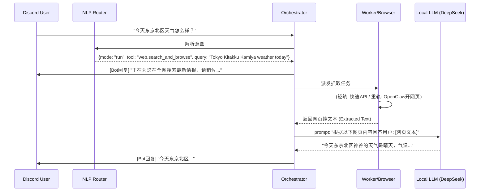

# NEXUS 实时联网与 OpenClaw 深度融合方案 (Web-Augmented Chat)

> **目标**：彻底解决 NEXUS 系统（基于本地大模型）在“闲聊/问答模式”下缺乏实时信息、无法回答诸如“今天天气如何”、“昨晚比赛结果”等问题。打通从意图识别到自动化浏览器抓取，再到大模型总结的人性化闭环交互体验。

---

## 1. 核心痛点与挑战

目前 NEXUS 的架构中，`Chat` 模式与 `Run` (任务模式) 是割裂的：
*   **Chat 模式**：用户输入 -> NLP 判定为聊天 -> 丢给本地 LLM (`callLocalOllamaChat`) -> LLM 因缺乏外部数据而触发“我不知道”或“请自行查询”的 Fallback。
*   **Run 模式**：用户下发量化或新闻指令 -> Orchestrator 生成任务放入 Redis -> Worker 执行 -> Orchestrator 收到结果后直接丢一张生硬的 Embed 卡片给用户。

同时，项目中重金打造的 **OpenClaw (浏览器自动化组件)** 目前只能通过特定 API 触发，无法参与到用户的日常对话中。

---

## 2. 总体架构：ReAct 范式的隐式联网链路

为了让用户体验如丝般顺滑，我们引入类似于 Perplexity 或 ChatGPT Web Search 的 **“意图感知 -> 自动联网/开浏览器 -> 上下文注入 -> 最终回答” (ReAct)** 的隐藏工作流。

### 2.1 架构时序图


---

## 3. 功能模块设计

### 3.1 意图路由层扩充 (Router.js)
在 `AGENT_TOOLS_SCHEMA` 中新增基础通用上网工具，并更新 Prompt，让大模型学会识别时效性问题。

```json
{
  "tool_name": "web.search_and_browse",
  "description": "当用户询问天气、最新新闻、实时事件或某个不知名的概念时调用。利用互联网搜索引擎或 OpenClaw 抓取最新信息。",
  "parameters": {
    "query": "需要搜索的核心关键字，例如 'Tokyo Kitakku weather today'"
  }
}
```

### 3.2 双轨制数据抓取引擎 (Worker 层)
为了平衡“速度”与“深度”，我们采用双轨制抓取：

*   **轻轨（Light Track）- DuckDuckGo / Tavily API**：
    *   **触发条件**：常规的实体查询、天气、比分。
    *   **速度**：< 2 秒。
    *   **实现**：使用 Python 库 `duckduckgo-search` 获取前 5 个结果的摘要（Snippet）。
*   **重轨（Heavy Track）- OpenClaw 浏览器渲染**：
    *   **触发条件**：轻轨无结果，或者明确需要查阅具体网页（例如用户发了一个链接）。
    *   **速度**：5 - 15 秒。
    *   **实现**：调用现有的 `openclaw-adapter` 发送 `browser.open`，利用 Playwright 获取渲染后的 DOM，通过 BeautifulSoup 清洗掉 HTML 标签，只保留正文返回。

### 3.3 Orchestrator 的 Chat 回收再加工 (Synthesis)
这是最关键的一环。原本 Worker 返回结果后，Orchestrator 会通过 `startResultConsumer` 广播。
我们需要拦截 `web.search_and_browse` 的结果，**不发 Embed 卡片**，而是将其作为大模型的 `Context`：

```javascript
// 当收到 web.search_and_browse 的结果时：
const searchData = taskResult.output.extracted_text; 
const originalQuestion = ctx.input_text;

const contextPrompt = `
[实时互联网情报]
${searchData}

请根据以上提供的实时情报，用自然、流畅的语言回答用户的原始问题："${originalQuestion}"。不要提及你是一个AI，也不要暴露搜索过程。
`;

// 隐式调用本地大模型进行总结
const finalReply = await callLocalOllamaChat(CURRENT_LOCAL_MODEL, contextPrompt);
await channel.send(finalReply);
```

---

## 4. 实施阶段计划

### Phase 1: 极速搜索打通 (MVP-Web)
*   **目标**：让模型立刻能够回答“天气”等基础常识更新。
*   **改动点**：
    1.  修改 `orchestrator/src/nlp/router.js` 增加 `web.search_and_browse` Schema。
    2.  在 `worker-quant/worker.py` (或新增的 worker) 中实现轻量级 `DuckDuckGo` 搜索接口。
    3.  修改 `orchestrator/src/index.js` 的 `startResultConsumer`，拦截搜索结果并回炉给 Ollama 总结。

### Phase 2: OpenClaw 深度融合 (Deep Browse)
*   **目标**：让系统能够访问用户贴出的链接，阅读长篇文章并进行总结。
*   **改动点**：
    1.  增强 `worker`，当发现 URL 或轻量搜索不满足时，通过 HTTP POST 请求本地的 `openclaw-adapter`（端口 `18081`）。
    2.  执行 `browser.open`，并增加一个 `browser.extract_text` 动作，将清洗后的 DOM 文本传回。
    3.  设置截断机制，防止数万字的网页把 `OLLAMA_NUM_CTX` (4096) 撑爆。

---

## 5. 预期效果对比

*   **之前**：
    > 用户：今天天气怎么样？
    > NEXUS：对不起，我是一个没有联网的AI，无法获取实时天气。
*   **改造后**：
    > 用户：今天天气怎么样？
    > NEXUS（1秒内）：*“正在全网搜索最新情报，请稍候...”*
    > NEXUS（3秒后）：*“今天东京都北区的气温是15度，天气晴朗，适合出行。”*